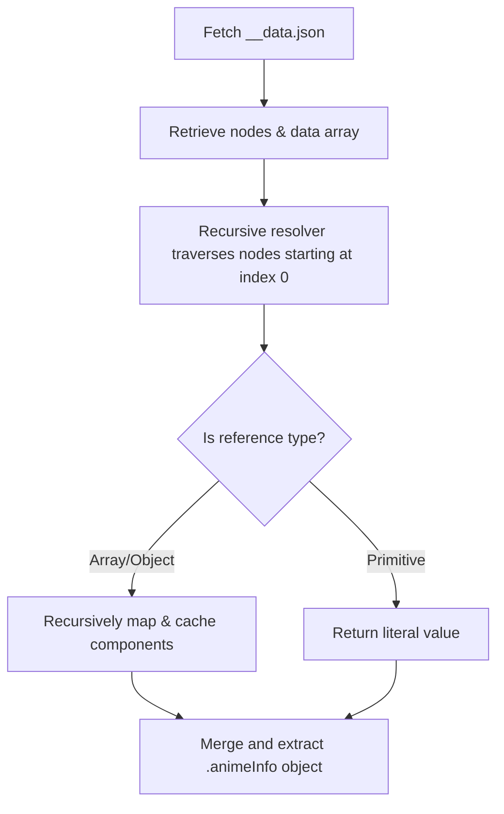
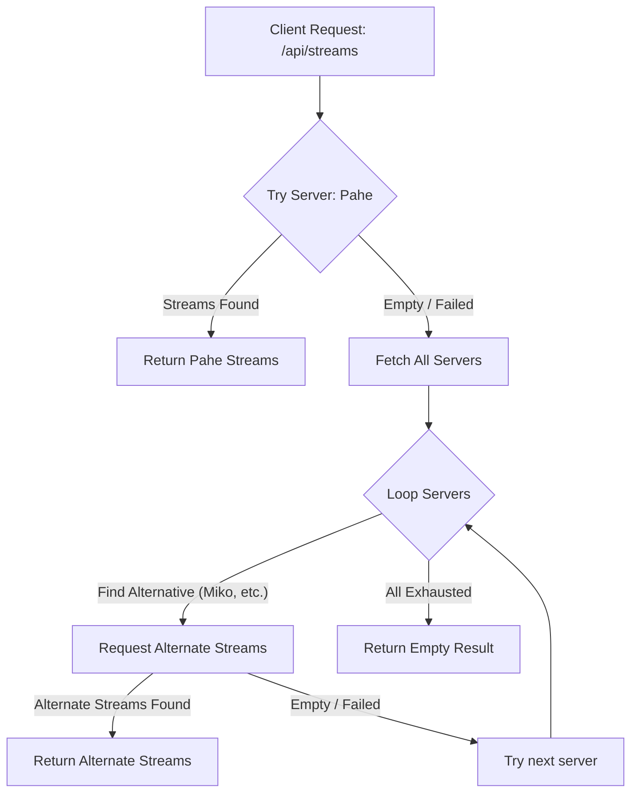
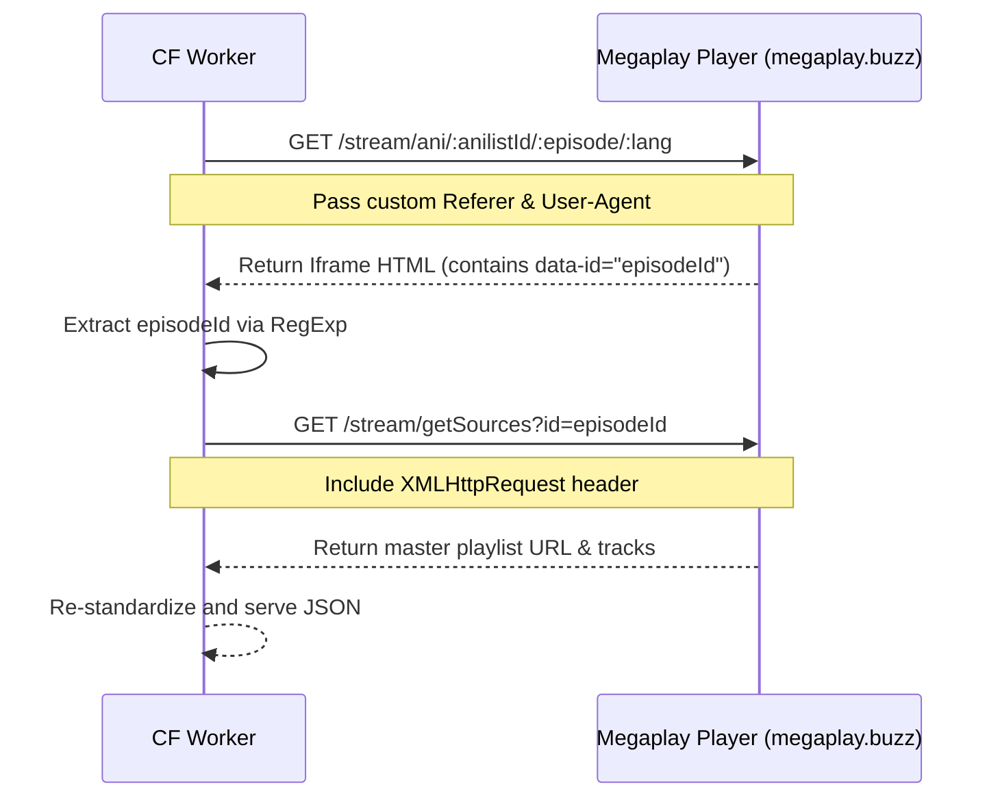

# 🎬 Anikage Anime Scraper API

[](https://workers.cloudflare.com)
[](https://www.typescriptlang.org/)
[](https://hono.dev/)
[](https://opensource.org/licenses/MIT)

A high-performance, full-featured scraper API for `anikage.cc` built on the ultra-fast **Hono** framework and fully typed with **TypeScript**. Tailored for zero-latency deployments on **Cloudflare Workers**. 

It handles everything from search queries (including mature content matching), SvelteKit data de-serialization, episode indexing, streaming servers matching, to auto-failover provider fallbacks and direct Megaplay extraction. It also packages a premium, responsive glassmorphism web-player.

---

## ⚡ Key Features

*   **Zero Cold Starts**: Lightweight bundle built for Cloudflare Worker edge nodes.
*   **Deep SvelteKit De-Serialization**: Integrates an advanced layout parser that recursively reconstructs references within serialized `__data.json` endpoints.
*   **Direct Video Streaming (Bypass Referer Blocks)**: Automatically maps encrypted streams to direct, open-CORS `https://prox.anikage.cc/` endpoints to maximize worker efficiency and avoid player buffering.
*   **Auto-Failover Resiliency**: The API dynamically falls back to alternate stream servers (e.g. Miko) if the primary server (`pahe`) is missing episodes.
*   **Megaplay Decryptor**: Directly scrapes the Megaplay player page, extracts internal episode tokens, and pulls native `.m3u8` master sources and subtitle tracks.
*   **Interactive Web Player**: Embeds a modern glassmorphism stream dashboard directly at `/player` using Hls.js customized to bypass MSE worker limitations.

---

## 🏗️ Architecture & Mechanics

### 1. SvelteKit Reference De-Serialization
Anikage is built using SvelteKit. Info requests fetch the page layout state via `__data.json` endpoints. Instead of flat objects, SvelteKit uses a serialized graph of indices referencing a flat values pool. 

This project implements a recursive devalue-resolver in `src/scraper.ts` that automatically traverses the layout graph:



### 2. Auto-Failover Stream Routing
Streaming providers might have gaps for certain episodes. The worker handles this gracefully by checking alternative servers automatically if the primary selection yields nothing.



### 3. Megaplay Direct Stream Extraction
For anime using the Megaplay player, the scraper mimics the browser lifecycle to pull the clean `.m3u8` and subtitles:



---

## 🚀 API Endpoints

### 1. Search Anime
Perform keyword searches across the entire directory (includes mature/18+ content filters).
*   **Endpoint**: `GET /api/search`
*   **Parameters**:
    *   `q` (required): Search keyword (e.g. `To Love Ru`, `Solo Leveling`)
    *   `page` (optional): Page number (default: `1`)
    *   `perPage` (optional): Results per page (default: `25`)
*   **Example**: `/api/search?q=To+Love+Ru&page=1`
*   **Sample Response**:
    ```json
    {
      "success": true,
      "data": {
        "results": [
          {
            "slug": "pQQW8nsEXr",
            "anilistId": 21822,
            "title": {
              "romaji": "To LOVE-Ru Darkness 2nd",
              "english": "To Love Ru Darkness 2nd",
              "native": "To LOVEる -とらぶる- ダークネス 2nd"
            },
            "coverImage": {
              "extraLarge": "https://s4.anilist.co/file/anilistcdn/media/anime/cover/large/bx20993-yIqN4gD0fCjO.png"
            },
            "type": "ANIME",
            "format": "TV",
            "status": "FINISHED",
            "totalEpisodes": 12,
            "currentEpisode": 12,
            "genres": ["Comedy", "Ecchi", "Romance", "Sci-Fi"]
          }
        ],
        "total": 12
      }
    }
    ```

### 2. Get Anime Metadata
Fetch details, synopsis, cover, banners, rating, and status info.
*   **Endpoint**: `GET /api/info`
*   **Parameters**:
    *   `slug` (required): Anime unique slug (e.g. `pQQW8nsEXr`)
*   **Example**: `/api/info?slug=pQQW8nsEXr`

### 3. Fetch Episodes List
Retrieve a clean list of episodes.
*   **Endpoint**: `GET /api/episodes`
*   **Parameters**:
    *   `slug` (required): Anime unique slug
*   **Example**: `/api/episodes?slug=pQQW8nsEXr`

### 4. Fetch Episode Servers
List available video stream providers for an episode.
*   **Endpoint**: `GET /api/servers`
*   **Parameters**:
    *   `slug` (required): Anime unique slug
    *   `episode` (required): Episode number (integer)
*   **Example**: `/api/servers?slug=pQQW8nsEXr&episode=1`

### 5. Fetch Episode Streams
Retrieve direct HLS M3U8 video stream lists and tracks. Auto-decrypts stream routes.
*   **Endpoint**: `GET /api/streams`
*   **Parameters**:
    *   `slug` (required): Anime slug
    *   `episode` (required): Episode number
    *   `provider` (optional): Server ID (default: `pahe`, fallback automatically triggered if empty)
    *   `lang` (optional): Language group (default: `sub`, alternatives: `dub`)
*   **Example**: `/api/streams?slug=pQQW8nsEXr&episode=1&provider=pahe&lang=sub`
*   **Sample Response**:
    ```json
    {
      "success": true,
      "data": {
        "sources": [
          {
            "url": "60e22ea13d...",
            "streamUrl": "https://prox.anikage.cc/stream/60e22ea13d.../index.txt",
            "quality": "auto"
          }
        ],
        "subtitles": []
      }
    }
    ```

### 6. Megaplay Scraper
Extracts raw HLS master playlists and subtitle files from Megaplay (`megaplay.buzz`).
*   **Endpoint**: `GET /api/megaplay`
*   **Parameters**:
    *   `anilistId` (required): AniList ID (integer)
    *   `episode` (required): Episode number (integer)
    *   `lang` (optional): Language group (default: `sub`)
*   **Example**: `/api/megaplay?anilistId=189046&episode=7&lang=sub`

### 7. Interactive Stream Player Page
*   **Endpoint**: `GET /player`
*   Open `/player` in your browser. Serves a premium, responsive glassmorphism player page built with HTML5, CSS, and Hls.js. Features an anime search bar, full episode checklist, quality selector, and server failovers.

---

## 💻 Local Development & Commands

1.  **Clone the Repository**:
    ```bash
    git clone https://github.com/Varomine/Anime-Scraper-API
    cd Anime-Scraper-API
    ```
2.  **Install Dependencies**:
    ```bash
    npm install
    ```
3.  **Start Development Server**:
    Runs the worker locally in wrangler:
    ```bash
    npm run dev
    ```
4.  **Test Endpoints**:
    Run the provided validation script to make test requests:
    ```bash
    node test_endpoints.js
    ```
5.  **Deploy to Cloudflare**:
    Publish the API directly to Cloudflare Workers:
    ```bash
    npm run deploy
    ```

---

## ⚙️ Configuration

Environment variables can be configured inside [wrangler.toml](wrangler.toml) under `[vars]`:

```toml
[vars]
PUBLIC_PROXY_URL = "https://prox.anikage.cc"
PUBLIC_AUTH_URL = "https://auth.anikage.cc"
```

---

## 🎨 Interactive Player Tech Details

The bundled player in [src/playerHtml.ts](src/playerHtml.ts) is configured for seamless media rendering:
*   **MSE Worker Bypass**: Hls.js demuxing web workers are disabled (`enableWorker: false`) to prevent rendering crashes on target browsers.
*   **Autoplay Rules**: Muted autoplay is enforced to comply with modern browser autoplay policies.
*   **Glassmorphism Theme**: Features fully responsive CSS grids, CSS variables, backdrop blur filters, and micro-interactions.

---

## 📄 License
Distributed under the MIT License. See `LICENSE` for details.
